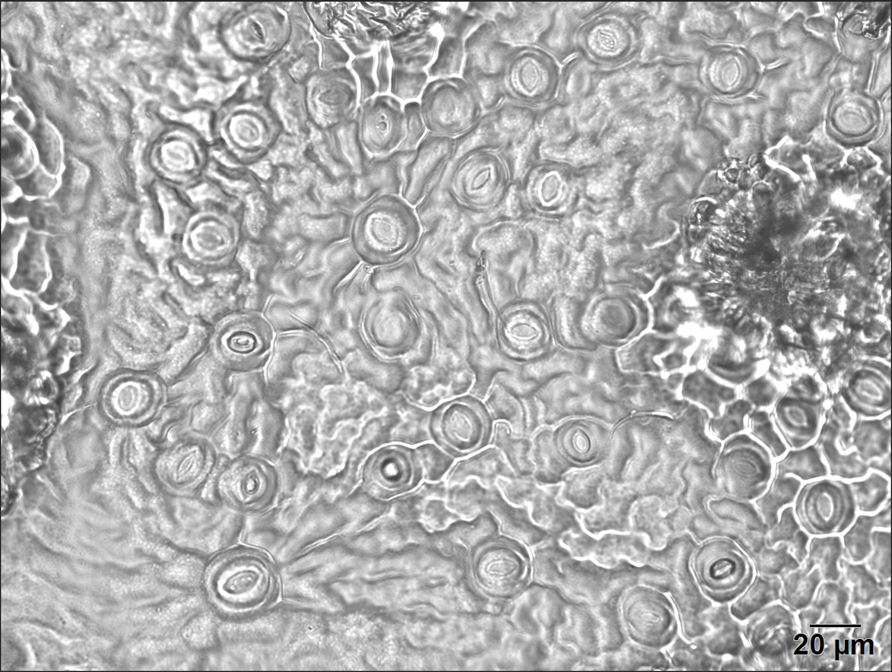

# stomatamodel

## Overview
This project implements a semantic segmentation model for detecting stomata in microscope images using a custom U-Net style of architecture. The model produces a binary masks that highlight stomata locations. 

## Utilities
This repository includes a few rudimentary utilities to help with the annotation to training pipeline

## Results/Predictions
Model accuracy has room for improvment and is currently limited by constraints with training data